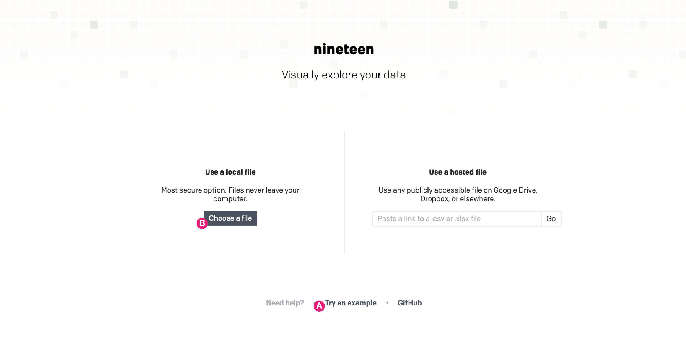
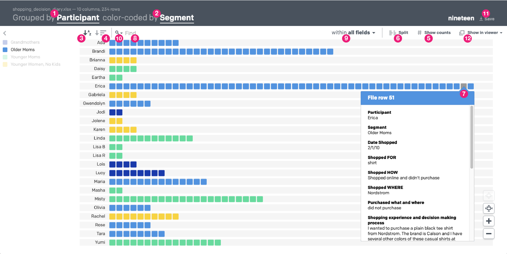

# Nineteen
### Nineteen is a qualitative data visualization app that turns .xlsx & .csv files into interactive visual tools 

### Basic Usage
New users may find it helpful use the "Try an example" link (A) at the bottom of [Nineteen's main page](https://usenineteen.com) first, 
before reading more here.

**Loading data:** The simplest use is to pick a file from your local files with the "Choose a file" (B) button on 
[Nineteen's main page](https://usenineteen.com). Each row of your data file becomes a data item, shown as a square in Nineteen's visualization.

  

**Data files - a few quick guidelines:**
- For Excel workbooks (.xlsx files), Nineteen only references the *first* worksheet/tab
- For both .xlsx and .csv files: 
  - Columns have headers/names in the first row (e.g.: "Participant", "Segment", "Date", "Description", etc.)
  - After the first row, each line is transformed into an individual data item, shown as a square in Nineteen's visualization
  - See the "Usable Example section, below, to see an actual data file and the visualization it produces

**You can control how data is displayed using two settings: grouping and color-coding:**
- Use the “group by” option (1) to display your data so that it is organized by a single column heading, such as participant
- Apply the “color by” option (2) to show how data in another column heading are distributed in your groups through color coding 
- For example: you can “group” your data by participant (say, column 1), then color code by any other column, such as segment (column 2). 
See the "Usable Example section, below, to see this example in an actual file & visualization.

  

  
### A Usable Example 
- **Try out a demo from the main page of Nineteen:** Click "Try an example" link (A) on [Nineteen's main page](https://usenineteen.com) 
- **See the example file:** You can download a copy of the 
[data file](https://github.com/UseNineteen/nineteen/blob/main/app/downloads/shopping_decision_diary.xlsx?raw=true) used for the example

### Additional Features to Discover
Nineteen does not make any changes to your data, so feel free to explore the UI. Additional features include:
- **Sorting:** You can sort the visualization by alphanumeric order (3) or by the number of items in each group (4)
- **Counting:** Nineteen can show counts by group with the "show counts" button (5)
- **Splitting:** If you have color coded your visualization, you can split your groups visually using the "split" button (6)
- **Detailed viewer:** mouse over any item in the visualization to see all the data from that row of your file (7):
	- Clicking the data item connected to the pop-up viewer will keep the viewer window visible until you close it
	- You can have multiple viewers open at once and you can click & drag them to move & organize them
	- The "Show in viewer" menu (12) allows you to configure what is included in the detailed view
- **Text search:** The search bar (8) can be found directly above the visualization frame:
	- Only items that match your search will remain in color. Non-matching items will be grayed out. Matching text will be highlighted in any pop-up viewers
	- Search in one or more columns (aka 'fields') (9) - by default, search looks at all of them, but you can choose to limit it as well
	- Mult-word search provides nuanced power:
		- Searching for *dog food* will match any items that have the word 'dog' *or* the word 'food' - only one needs to be there to match
		- Searching for *"dog food"* (with quotes) will match only items with the phrase "dog food"
		- Searching for *dog AND food* ('AND' must be capitalized) will match only items that have both "food" and "dog" somewhere in them, though they may not be found together
	- High frequency words are viewable within the search interace through a drop-down (10) in the search bar
- **Save:** You can save an image or a stand-alone version of the visualization tool (11). 
At present, the image saving is broken - it's a known issue which we are working to resolve.

### A Note About Data Privacy
All data processing happens in the browser. Users' data never makes it back to the server, with two possible exceptions - described below 
this means your research is *your research*. You can use it for confidential data without worrying about uploading your data to some random server, as 
long as you avoid two features:

1. If you want to save copies of the visualization as a static image or as a stand-alone HTML file that will open with a saved view of the data & 
allow full interaction with it, you can – but this will require a brief round-trip of your data so things can be packaged up. 
No data is ever saved or stored.
2. Importing data hosted elsewhere on the internet -  If you choose to source a file hosted elsewhere, Nineteen will attempt to make a local XHR request, 
but only if your browser supports both the File API and XHR Response Type Blob. Otherwise, it will use the server will to download 
the file and convert it. It may also end up using the server process if the remotely hosted data's server does not set the 
Access-Control-Allow-Origin header. 

In both cases, data is not stored on the server longer than it takes to process your request and send the data back to your browser. 
Your data is your data.

## Need More Help?
Email [Ted Pollari](mailto:ted@pollari.org?subject=Nineteen%20Help) and/or [Kim Erwin](mailto:kerwin@id.iit.edu?subject=Nineteen%20Help), 
the creators of Nineteen -- We'd also love to hear how you're using Nineteen, if it's useful for you!

